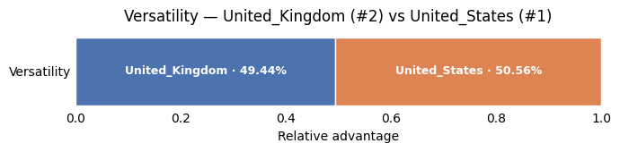
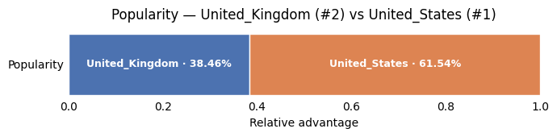
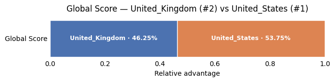
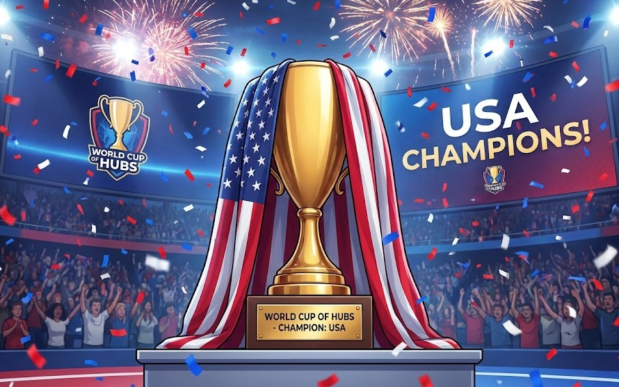
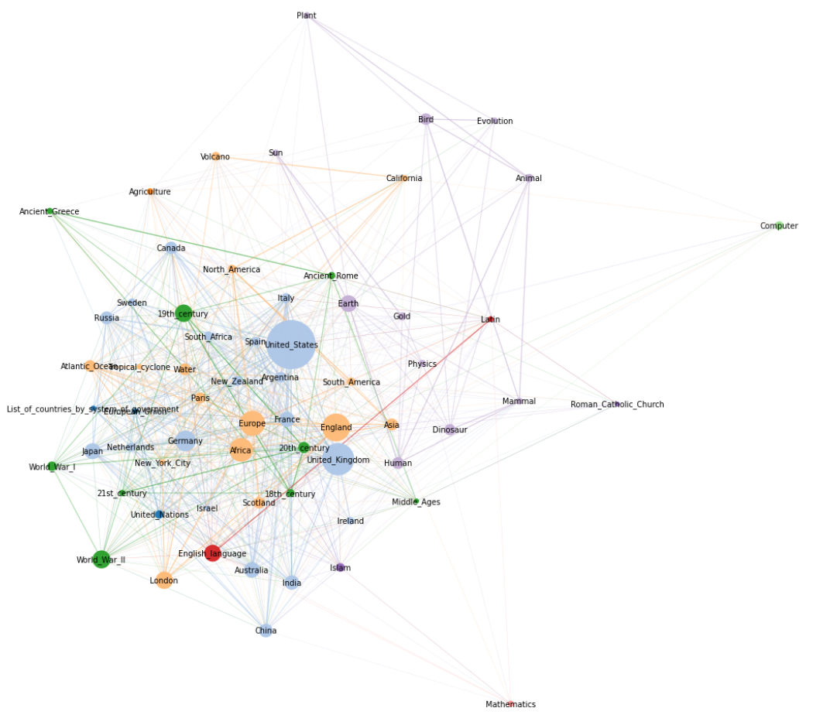

# The Grand Final

After weeks of competition, countless matchups, and relentless eliminations, the World Cup of Hubs reaches its final moment.

Two hubs remain:  
**[United States](https://en.wikipedia.org/wiki/United_States)** vs **[United Kingdom](https://en.wikipedia.org/wiki/United_Kingdom)**

Both have survived the group stage and three knockout rounds. Each followed a different path, faced different opponents, and proved its strength under pressure.

On their way to the final, the **United States** had to overcome a mix of artists and strong national challengers, including **Paul McCartney**, **Germany**, and **South Africa**.

The **United Kingdom**, on the other hand, eliminated a combination of scientific concepts and countries, knocking out the **Periodic Table**, **Israel**, and **Japan**.

Before revealing the outcome, we invite you to pause for a moment. Open the two pages, scroll through them, and trust your intuition. Which one *feels* more central, more connected, more influential? Sometimes, the winner can already be guessed by simply looking at the hubs themselves.

---

## The Final Match, And the Champion Is…

The Grand Final is decided in a single, decisive confrontation.

The two hubs are evaluated head-to-head using the same scoring framework as in previous rounds. All metrics are applied consistently, and only relative performance matters.

Let's reveal the results metric by metric. 

**Efficiency** is something we saw the UK struggle with in its match against Japan. How does it fare against the USA here?

As you can see it's a very, **very** close match. Both seem to be on equal footing regarding how quickly they lead to victory in the Wikispeedia game.

Now let's look at **Versatility**. The UK was much more versatile than Japan before—will it manage to win this metric over the USA?

Once again, a terribly close call, but the USA manages to pull ahead here! So far this match has proven to be extremely close! But one hub must make it out on top. Will popularity clear up the winner? We saw how much more popular the UK was previously against Japan. This could be a chance for the UK to secure the victory! Let's look at this final metric:

The USA completely slams the door on the UK with popularity. It proves it is the dominant hub by winning over the UK (which was already a very promising hub) in all three metrics. The USA has it all: it helps reach the end goal faster, it has a wide breadth of connections, and it is immensely popular. Here is the final score:

🏆 **Champion: United_States**

This hub is crowned the **World Cup of Wikipedia Hubs champion**.

---

## Final Results

The tournament concludes with a final ranking of the top competitors.

**Top 1 : United States**  

**Top 2 : United Kingdom**  

**Top 4 : South Africa, Japan**

**Top 8 : Israel, London, Germany, New York City**  

---

## Looking Back at the Tournament : Which betting strategy was the best?

Now the part you have been waiting for: did you win some money?

We always assume players have 80 $ and bet 10 $ on each of 8 articles.

---

#### Strategy 1 – Follow the bookmakers

If someone simply follows the best odds given by the bookmakers on the real competition, they would win on:

| Article        | Odd  | Result |
|----------------|------|--------|
| United States  | 1.00 | WIN    |
| United Kingdom | 3.36 | WIN    |
| Europe         | 4.34 |        |
| England        | 5.09 |        |
| France         | 5.23 |        |
| Germany        | 5.75 | WIN    |
| World War II   | 6.07 |        |
| Africa         | 6.99 |        |

Total return:

- `10 × (1.00 + 3.36 + 5.75) = 10 × 10.1 = 101.1 $`

Profit:

- `101.1 $ − 80 $ = 21.1 $`

---

#### Strategy 2 – Perfectly predict the Top 8 hubs

If someone predicted the 8 best hubs:
 
  **United States, Japan, South Africa, United Kingdom, Israel, London, Germany, New York City**

The return from the 8 winners would be:

- `10 × (1.00 + 7.44 + 10.63 + 3.36 + 11.53 + 7.61 + 5.75 + 11.08) = 584 $`

Profit:

- `584 $ − 80 $ = 504 $`

Not to mention that some hubs ranked high in the competition (Albert Einstein or Periodic Table were in Top 16) but were not even proposed by the bookmakers. This shows that the bookmakers could not predict the competition perfectly and that graph analysis alone is not sufficient to estimate Wikispeedia players’ behaviors.

Nonetheless, all Top 8 contenders were predicted as being in the Top 64 by the bookmakers, showing that their graph analysis was efficient enough. In addition, underdogs that are not proposed in the betting area are part of the game of betting: bookmakers cannot predict the future, and that's also one way how they make money themselves.

---

#### Strategy 3 – Use global popularity

Picking the top 8 most popular pages on Wikipedia over the last 10 years.  
We realize that these are **not** the same as the nodes favored by the Wikipedia link architecture, so the overlap with the bookmaker’s list is limited (see Strategy 1). Indeed, we need to go up to the 15th most visited page of Wikipedia to find 8 articles that are also proposed by the bookmakers.

| Rank | Top article by popularity on the real world wikipedia | Selected in strategy | Result |
|------|-------------------------------------------------------|----------------------|--------|
| 1    | United States                                         | X                    | WIN (1.00) |
| 2    | Wikipedia                                             |                      |        |
| 3    | India                                                 | X                    |        |
| 4    | Google                                                |                      |        |
| 5    | World War II                                          | X                    |        |
| 6    | Adolf Hitler                                          |                      |        |
| 7    | United Kingdom                                        | X                    | WIN (3.36) |
| 8    | Barack Obama                                          |                      |        |
| 9    | World War I                                           | X                    |        |
| 10   | Michael Jordan                                        |                      |        |
| 11   | Winston Churchill                                     |                      |        |
| 12   | China                                                 | X                    |        |
| 13   | Elvis Presley                                         |                      |        |
| 14   | Canada                                                | X                    |        |
| 15   | Australia                                             | X                    |        |

Total return:

- `10 × (1.00 + 3.36) = 43.60 $`

Profit:

- `43.60 $ − 80 $ = -36.4 $`

This strategy performs pretty badly. It shows that using **page popularity** is not reliable for predicting players’ behavior. Relying only on the **graph architecture** like in Strategy 1 seems to be slightly better.

---

#### Strategy 4 – Human Intuition

Let's see how much money our group made...

| Player | Winning bets                         | Profit                                       |
|--------|--------------------------------------|----------------------------------------------|
| Noa    | London                               | -80\$ + 7.61 × 10\$ = -3.90\$                |
| Tolga  | United_States, United_Kingdom        | -80\$ + 1 × 10\$ + 3.36 × 10\$ = -36.40\$    |
| Antoine| -                                    | -80\$ + 0\$ = -80\$                          |
| Max    | United_States                        | -80\$ + 1 × 10\$ = -70\$                     |
| Julien | United_States                        | -80\$ + 1 × 10\$ = -70\$                     |

This shows that, based on no serious strategy, humans perform pretty badly on this type of gamble. Did you do better? Let's see:

---

#### Strategy 5 : YOUR BET

Below you can see the 8 contenders you selected on the betting floor and how they compare to the actual final Top 8.

---

## Analysis and Insights

With the champion crowned, it is time to step back and analyze what truly determined success.

**Dive into the data and understand the results.**  

  <a href="/ada-template-website/analysis" class="change-page-button">
    Go to next chapter : Further Analysis
  </a>

