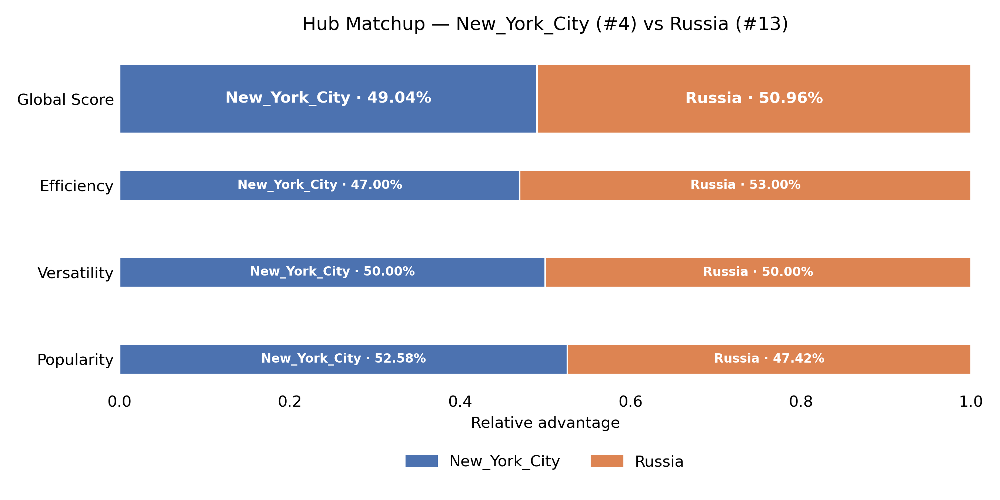
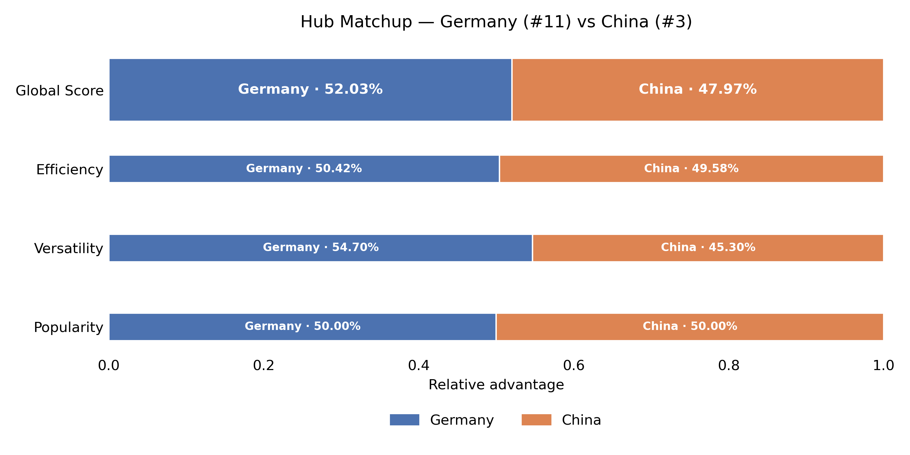
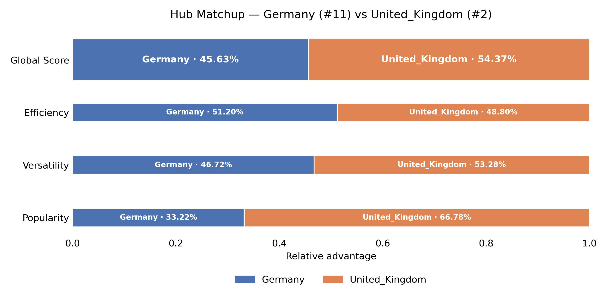

## Round of 16 : The First Knockout

The Round of 16 marks the first true elimination stage.

Each matchup opposes:
- a **group winner**,
- against a **repechage qualifier**.

In each match, hubs are evaluated head-to-head using the tournament scoring system. Only the winner advances.

<!-- Placeholder: Table or bracket showing Round of 16 matchups and winners -->

**The bracket starts normal… then Russia drops a bomb**

Most top seeds do their job early: **United_States (1)** and **United_Kingdom (2)** both advance, and **China (3)** also holds.

But the Round of 16 has two real “plot twist” moments.

The other upset is **Germany (11)** beating **Japan (6)**.  
This one is less extreme than Russia’s win, but it matters a lot because it plants a dangerous underdog into the top half of the bracket.

The biggest shock is **Russia (13)** knocking out **New_York_City (4)**.  
That’s not a small slip, it’s a massive seeding upset (13 over 4), and it instantly breaks the expectation that a top-4 seed cruises into the late rounds.

Let's have a closer look to the biggest upset of this stage :

This is one of the most surprising results in the bracket: Seed 13 eliminating Seed 4.

At first glance, the **Global Score is extremely close** (Russia 50.96% vs NYC 49.04%), meaning the outcome is decided on very fine margins.  

Versatility is a complete tie (50–50), while **Popularity actually favors New York City (52.58% vs 47.42%)**.  

However, Russia quietly dominates **Efficiency (53% vs 47%)**, which turns out to be the decisive factor.  
This suggests that Russia’s hub structure is more compact or strategically connected, possibly due to strong centralization around political, historical, and geopolitical narratives.

This upset happens because NYC’s strength is *visibility-driven*, while Russia’s is *structure-driven*. In a head-to-head comparison where efficiency matters, Russia gains just enough edge to flip the outcome.

---

## Quarter-Finals : The Tension Rises

Eight hubs remain.

At this stage, the matchups become tighter.  
Every remaining competitor has already proven its ability to outperform strong opposition.

Differences between hubs are often subtle, and small advantages can decide entire matches.

<!-- Placeholder: Quarter-Final bracket or match summary table -->

**Upsets collide, and Germany turns into the main character**

Quarterfinals are where “random” underdogs usually get filtered out… but not here.

On paper, **Russia (13)** already overperformed by reaching this round but then it runs into **South_Africa (5)**, and South Africa shuts the door.  
So Russia’s run ends, but it still leaves the round as the biggest early-round disruptor.

At the top, **United_States (1)** beats **Adolf_Hitler (9)** which is a crazy matchup historically, the seed and history are both respected as the seed 1 goes through.

Meanwhile, the real headline is **Germany (11)** defeating **China (3)** to reach the semifinals.  
This is a major upset (11 over 3) and it’s not a one-off anymore: Germany has now won multiple rounds against stronger seeds, so it becomes the tournament’s true “Cinderella run”.

How did China lose that match-up ? 

On paper, this matchup looks lopsided: Seed 11 versus Seed 3.  
But the metrics tell a very different story.

Germany edges China on the **Global Score (52.03% vs 47.97%)**, and this advantage is not random.  

Efficiency is nearly a coin flip (50.42% vs 49.58%), and **Popularity is perfectly balanced (50–50)**, meaning the upset cannot be attributed to public bias or visibility. It is quite surprising knowing the different in populations of these two countries.

Germany’s decisive advantage lies in **Versatility (54.70% vs 45.30%)**.  
Germany acts as a connector across **many different thematic domains**, rather than being concentrated around a few dominant narratives. In hub terms, Germany likely links politics, history, economy, culture, science, and European context in a more evenly distributed way. 

This is not a “lucky” upset. Germany’s win is structurally justified by a strong versatility, making this one of those results where the seeding underestimates a genuinely strong competitor.

---

## Semi-Finals : The Final Four

Only four hubs are left standing.

The semi-finals represent the highest level of competition so far.  
Each remaining hub has demonstrated consistency across multiple rounds and against different types of opponents.

With the final in sight, the pressure reaches its peak.

<!-- Placeholder: Semi-Final matchups and results -->

Analysis of the results.

**The underdogs finally meet the ceiling**

By the semifinals, the bracket shows a classic pattern: the best seeds tend to regain control.

**United_States (1)** beats **South_Africa (5)**.  
South Africa had a solid, consistent run (and benefited from the bracket opening when Russia removed NYC), but the #1 seed ends the story.

Then there’s the other matchup: **United_Kingdom (2) vs Germany (11)**.  
Germany’s Cinderella run meets an elite seed and the UK stops it. What a run from our underdog but the opponent was this time too good for them and the game was not even close. Germany still went from the repechage group to the semi-finals.

After defeating China, Germany runs into a very different opponent.

Against the United Kingdom, Germany actually performs **better in Efficiency (51.20% vs 48.80%)**. This is a surprising result: the UK is a top-2 seed, yet Germany appears to have a slightly tighter or more optimally connected local structure. This suggests Germany’s internal link density or hub compactness is genuinely strong.
However, the match is decided elsewhere.

The UK dominates **Popularity (66.78% vs 33.22%)**, an overwhelming gap that Germany cannot compensate for.  
On top of that, the UK also leads in **Versatility (53.28% vs 46.72%)**, neutralizing the dimension that carried Germany in the previous round.

The **Global Score reflects this shift clearly**: 54.37% for the UK versus 45.63% for Germany.

Germany hits a structural ceiling. It can outperform strong but narrower hubs (like China), but once faced with a hub that combines breadth *and* massive popularity, its path ends.

---

## Next: The Grand Final

Two hubs remain.

Each followed a different path through the tournament, overcame different challenges, and proved its worth under pressure.

One last match stands between them and the trophy.

**Next: the Grand Final.**  
[Enter the Grand Final](ada-template-website/final)
