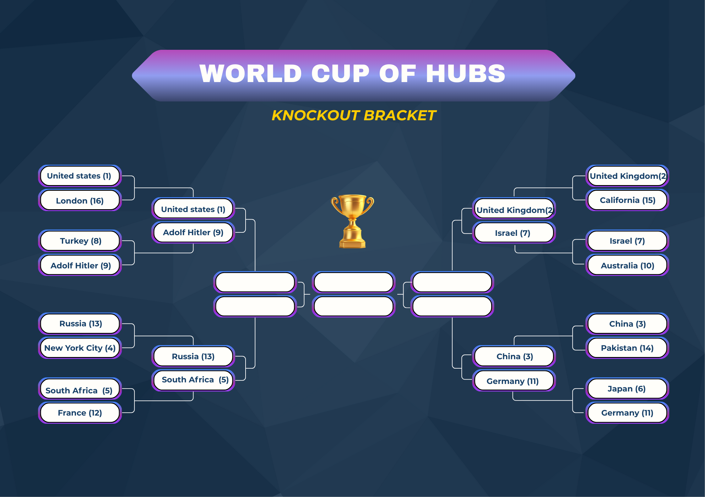
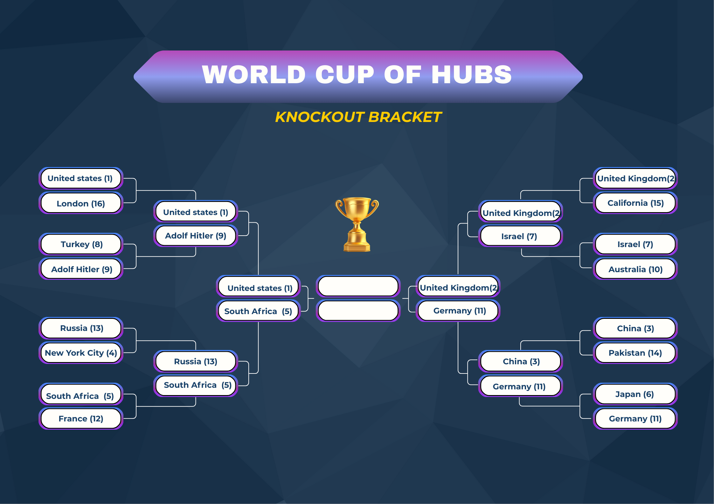

## Round of 16 : The First Knockout

The Round of 16 marks the first true elimination stage.

Each matchup opposes:
- a **group winner**,
- against a **repechage qualifier**.

In each match, hubs are evaluated head-to-head using the tournament scoring system. Only the winner advances.

<!-- Placeholder: Table or bracket showing Round of 16 matchups and winners -->

Analysis of the results.

---

## Quarter-Finals : The Tension Rises

Eight hubs remain.

At this stage, the matchups become tighter.  
Every remaining competitor has already proven its ability to outperform strong opposition.

Differences between hubs are often subtle, and small advantages can decide entire matches.

<!-- Placeholder: Quarter-Final bracket or match summary table -->

Analysis of the results.

---

## Semi-Finals : The Final Four

Only four hubs are left standing.

The semi-finals represent the highest level of competition so far.  
Each remaining hub has demonstrated consistency across multiple rounds and against different types of opponents.

With the final in sight, the pressure reaches its peak.

<!-- Placeholder: Semi-Final matchups and results -->

Analysis of the results.

---

## The Bracket So Far

With the semi-finals completed, the path to the final is fully revealed.

Below is the complete knockout bracket, showing the progression from the Round of 16 to the final matchup.

<!-- Placeholder: Full knockout bracket diagram with completed results -->

We hope your candidate did a good job, he is maybe even in the Grand Final !

---

## Next: The Grand Final

Two hubs remain.

Each followed a different path through the tournament, overcame different challenges, and proved its worth under pressure.

One last match stands between them and the trophy.

**Next: the Grand Final.**  
[Enter the Grand Final](ada-template-website/final/)
