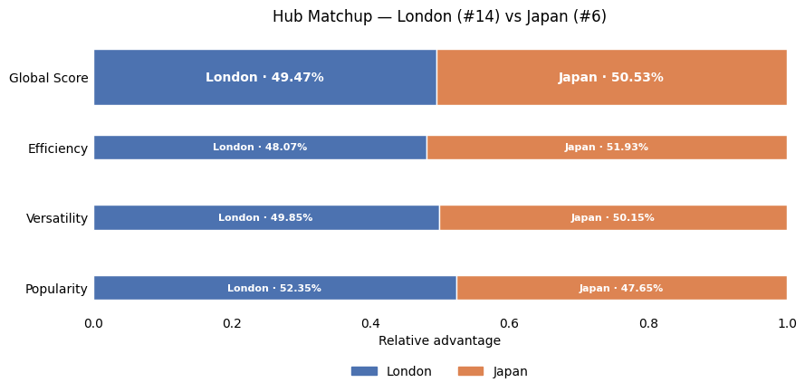
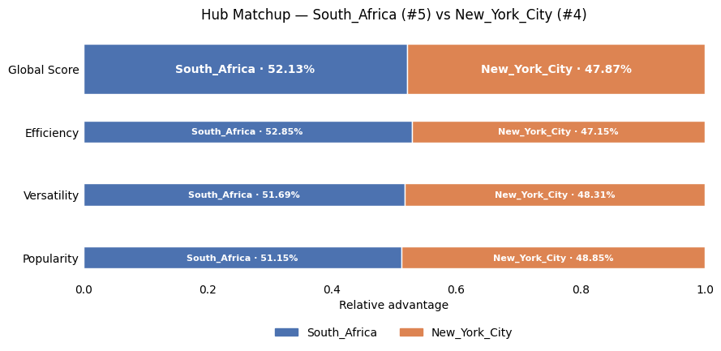
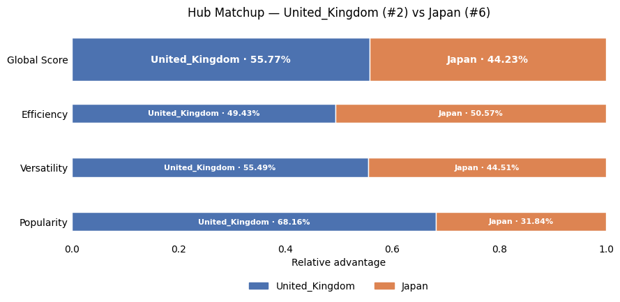

## Round of 16 : The First Knockout

The Round of 16 marks the first true elimination stage.

Each matchup opposes:
- a **group winner**,
- against a **repechage qualifier**.

In each match, hubs are evaluated head-to-head using the tournament scoring system. Only the winner advances.

**The bracket starts normal… then London drops a bomb**

Most top seeds do their job early: **United_States (1)** and **United_Kingdom (2)** both advance, and **New York City (4)** also holds. However, something drastic happens to **China (3)**. 

The Round of 16 has two upsets.

The first upset is **Germany (9)** beating **Turkey (8)**.  
This one is less extreme than China’s loss, but it matters a lot because it plants a dangerous underdog into the top half of the bracket.

The biggest shock is **London (14)** knocking out **China (3)**.  
That’s not a small slip, it’s a massive seeding upset (14 over 3), and it instantly breaks the expectation that a top-4 seed cruises into the late rounds.

Let's have a closer look to the biggest upset of this stage :

This is one of the most surprising results in the bracket: Seed 14 eliminating Seed 3.

At first glance, the **Global Score is extremely close** (London 50.79% vs NYC 49.21%), meaning the outcome is decided on very fine margins.  

Popularity is a very close (50.79% vs. 49.21%, actually reflecting the final result) , while **Effciency actually favors China (52.15% vs 47.85%)**.  

However, London quietly dominates **Versatility (54.2% vs 45.8%)**, which turns out to be the decisive factor.
This suggests that London’s hub is more strategically connected, possibly due to strong centralization around people and business. Even if both share a wide spread of categories associated to them, London might be more precise and offer more variety.

In a head-to-head comparison where versatility matters, London gains just enough edge to flip the outcome.

This is the state of the bracket after these riveting matchups :

<!-- Placeholder: Table or bracket showing Round of 16 matchups and winners -->

---

## Quarter-Finals : The Tension Rises

Eight hubs remain.

At this stage, the matchups become tighter.  
Every remaining competitor has already proven its ability to outperform strong opposition.

Differences between hubs are often subtle, and small advantages can decide entire matches.

**Upsets collide, and only the strong remain**

Quarterfinals are where “random” underdogs usually get filtered out… 

On paper, **London (14)** already overperformed by reaching this round but then it runs into **Japan (6)**, and Japan shuts the door. Let's look at this more closely!

Against an opponent who we saw had a strong versatility, Japan manages to match and even prove it's slight strength in that domain. Japan is even less popular than China was, yet it manages to overpower London's effciency! A very close match that proves that London was not just here randomly!

However, the results are set, and London’s run ends, but it still leaves the round as the biggest early-round disruptor.

At the top, **United_States (1)** beats **Germany (9)** (the other upset from the previous round) which is a crazy matchup historically! The seed and history are both respected as the seed 1 goes through.

Meanwhile, the real headline here is **South Africa (5)** defeating **New York City (4)** to reach the semifinals.  
This is a minor upset (5 over 4) but the results show a devastating story for NYC.

Based on the seeds, you would've imagined this matchup to be close.  
But the metrics tell a very different story.

**South Africa dominates in every field.** 

This is not a “lucky” upset. South Africa’s win is structurally justified by every metric, making this one of those results where the seeding underestimates a genuinely strong competitor.

The scores have decided! Here is how the bracket looks before we head to the semi-finals.

<!-- Placeholder: Quarter-Final bracket or match summary table -->

---

## Semi-Finals : The Final Four

Only four hubs are left standing.

The semi-finals represent the highest level of competition so far.  
Each remaining hub has demonstrated consistency across multiple rounds and against different types of opponents.

With the final in sight, the pressure reaches its peak.

**The underdogs finally meet the ceiling**

By the semifinals, the bracket shows a classic pattern: the best seeds tend to regain control.

**United_States (1)** beats **South_Africa (5)**.  
South Africa had a solid, consistent run, and we saw how impressive its previous match was, but the #1 seed ends the story.

Then there’s the other matchup: **United_Kingdom (2) vs Japan (6)**.  
We saw Japan manage to shut down an underdog, but how will it fair against a truely strong opponent. This by all means should be a close matchup, let's display the statistics!

And these are the most dramatic results we've seen! The **United Kingdom** completly beats **Japan** here a stunning **55.77% vs 44.23%**.

Against the United Kingdom, Japan actually performs **slightly better in Efficiency (50.57% vs 49.43%)**. This is a surprising result: the UK is a top-2 seed, yet Japan appears to have a slightly tighter or more optimally connected local structure. This suggests Japan’s internal link density or hub compactness is genuinely strong.
However, the match is decided elsewhere.

The UK dominates **Popularity (68.16% vs 31.84%)**, an overwhelming gap that Japan cannot compensate for.  
On top of that, the UK also leads in **Versatility (55.49% vs 44.51%)**, neutralizing the other dimension that helped Japan reach this round.

Japan hits a structural ceiling. It can outperform strong but less effcient hubs (like NYC), but once faced with a hub that combines good effciency, breadth *and* massive popularity, its path ends.

Let's have a final look at the bracket before moving on to the final :

<!-- Placeholder: Semi-Final matchups and results -->

---

## Next: The Grand Final

Two hubs remain.

Each followed a different path through the tournament, overcame different challenges, and proved their worth under pressure.

One last match stands between them and the trophy. A match between two powerhouses of the hub community. Who do *you* think will win? 

**Next: the Grand Final.**  
[Enter the Grand Final](ada-template-website/final)
