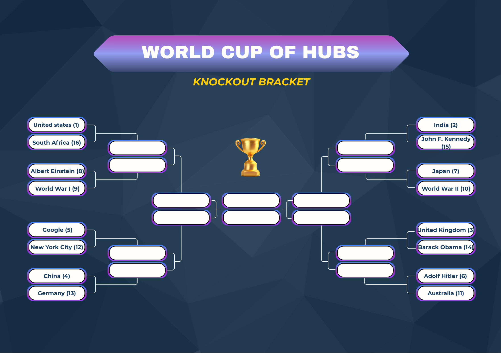

## Group Stage Results

During the group stage, hubs are evaluated against the other members of their group.
Below are the final standings of the group stage.

<!-- Placeholder: Group-stage result tables (normalized scores only) -->

After the group stage, a clear picture emerges: this tournament is dominated by **countries**.

This dominance is not only about fame. Countries benefit from being connected to **many different topics at once**: history, politics, culture, economy, science, and geography. Over a group stage, that breadth matters more than momentary popularity.

There are, however, a few results that raise eyebrows. In Group 1, Barack Obama finishes last despite his global recognition, showing that individual leaders can be overshadowed when surrounded by broader historical and cultural hubs. In Group 5, Turkey surprisingly finishes ahead of Google and Elvis Presley. Group 6 is also striking: New York City tops a group packed with extremely strong names, including Adolf Hitler and Wikipedia, a urban hub can be a good Wikipedia hub too.

---

## The Repechage : Second Chance Round

Finishing outside first place does not mean elimination.

Hubs ranked **2nd, 3rd, and 4th** in their respective groups enter the **Repechage**. 

By the end of the repechage, the remaining contenders will go through to go into the **Round of 16**, but this is the last chance for these contenders to survive in the competition.

<!-- Placeholder: Repechage results table or diagram -->

**Second chances change the story**

London, as a global city, qualifies with authority.

The Periodic Table advances as the backbone of science itself, trying to carry and survive as the last scientific topic hub.

The Beatles survive a very tight battle against Adolf Hitler, maybe they would have been the best solution in World War II.

Paul McCartney qualifies on his own, confirming that an artist can stand tall even without the band behind him.

Albert Einstein, reminds everyone that his ideas that changed how we see the universe can be better than nations, he dominates his playoff.

Germany and Russia moves on calmly. Same for France that edges past its rivals, reinforcing the idea that real-world history and state power still matter more than fictional fame.

We hope your contender went through and managed to qualify for the knockout stages !

---

## Who Qualifies for the Knockout Phase

By the end of the group stage and the repechage, the field is reduced to **16 hubs**:

- **8 Group Winners**, who finished first in their respective groups  
- **8 Repechage Winners**, who earned their place through the second-chance round  

These 16 competitors advance to the **Round of 16**, marking the beginning of the knockout phase.

---

## Building the Knockout Bracket

The knockout stage is not drawn at random.

To reward strong performance in the group stage and preserve competitive balance, the bracket is built using a **seeding system**, similar to those used in tennis Grand Slams.

The rules are as follows:

- Each **group winner** is paired against a **repechage winner** in the Round of 16  
- Group winners are assigned a **seed** based on their pre-tournament odds of winning (lowest volatilty)

This ensures that the winner of the group stage face gets a litttle advantage by normally facing a weaker opponent from the *loser bracket*. In other words, the better a hub performs early on, the more favorable its path becomes but nothing is guaranteed.

It is still a deadly match, we might see some upsets !

The bracket is constructed so that:
- the **top seed** and the **second seed** can only meet in the **Grand Final**,  
- other high seeds are placed on opposite sides of the bracket,  
- and potential matchups become progressively harder as the tournament advances.

It is time ot discover the final table of the tournament !

The Round of 16 is the first moment where the bracket really starts to take shape.  
Big favorites like the **United States (1)**, **United Kingdom (2)**, and **China (3)** enter the competition with high expectations, facing lower-seeded opponents that look weaker on paper.

However, not all matches are so clear. Some games are very close in seeding, such as **Turkey (8) vs Germany (9)** and **Israel (7) vs France (10)**, where a small difference could change everything.

There are also interesting and symbolic matchups. **United Kingdom (4) vs Periodic Table (13)** is a interesting matchup between geography and science, while **Japan (6) vs Russia (11)** is another shock of cultures.

This round sets the tone for the tournament: top seeds try to avoid surprises, while lower seeds look for one chance to create an upset.

---

## Next: The Knockout Phase Begins

The structure is set.  
The paths are drawn.  
There are no more second chances.

From here on, every match is a direct duel : win and advance, or lose and go home.

**The Round of 16 and the road to the Grand Final.**  

  <a href="/ada-template-website/knockouts" class="change-page-button">
    Go to next chapter : The Knockout Phase
  </a>

