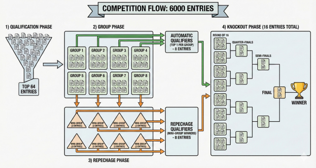

# Structure of the Tournament

Before the first match is played, the rules of the competition must be clear.

This page explains how the World Cup of Hubs is organized and how competitors are evaluated in the tournament.

---

## Tournament Overview

The competition design is inspired from a football world cup with some add-ons to take out progressively contenders until we get a final vagiation champion.

It works in several stages, each increasing in selectivity:

- **Group Stage**  
    We start the competion by having 8 groups of 8 hubs. 
    To ensure a fair group stage, groups are **not formed at random**.

    Before the draw, all qualified hubs are ranked according to their **pre-tournament odds**. Based on this ranking, hubs are divided into **seeding bins** (sometimes called *pots*), a system commonly used in real-world tournaments such as the Football World Cup or in Tennis.

    Each bin contains hubs of similar expected strength.

    The group draw then proceeds as follows:
    Each group contains one hub from each *pot*. This guarantees that no group contains more than one major favorite and provide a balanced mix of favorites, challengers, and outsiders in every groups.

    This mechanism prevents early concentration of strong contenders in the same group.
    The **1st** of each group will go through and qualify for the **Round of 16**.

- **Repechage (Second Chance)**  
    Hubs ranked **2nd, 3rd, and 4th** in their groups are not eliminated yet.  
    They enter a *loser group stage* and are given a last chance in groups of 3. Only **8 hubs will survive** from these mini-leagues and earns their ticket to the **Round of 16**.

- **Knockout Phase**  
    From this point, there are **no second chances**.  
    Qualified hubs face each other in **head-to-head duels**, where only the winner advances.

- **Final**  
    After the Round of 16, Quarter-Finals, and Semi-Finals, two hubs remain.  
    One of them is crowned the **World Cup of Wikipedia Hubs champion**.

<!-- Placeholder: Diagram illustrating the full tournament flow -->

---

## How Hubs Are Scored During the Tournament

Hubs do not compete based on a single statistic.

Instead, each competitor is evaluated using a **composite score** that captures three main aspects of navigation quality. 

---

### The Three Dimensions of Performance

- **Popularity**  
  Popularity captures how often a page is used by players during Wikispeedia games.  
  It reflects whether a hub is frequently encountered, rediscovered after backtracking, or consistently involved in successful navigation paths.

- **Versatility**  
  Versatility measures how a hub connects different areas of knowledge.  
  Pages that bridge multiple topics or appear in diverse navigation contexts are considered more versatile.
  This is all based off the categories which you can visualize here with this correlation graph between all of them :
  

  You can see that some of these categories can be very close, so we curate them based on similarity and end up with a list of categories for each article. For example, here's the category hierarchy of Gottfried Wilhelm Leibniz. 
  

  The Versatility score is then based off how many catefories each hub has, giving more weight to the ones who appear less frequently!

- **Effectiveness**  
  Effectiveness reflects whether visiting a page helps players make progress toward their target or slows them down.  

Each of these metrics highlights a different aspect on how we could define a hub beinf a **good hub**. 

### From Metrics to a Match Score

To decide match outcomes, the three dimensions are combined into a **single score** for each hub. This score acts as the referee’s decision: it determines which hub performs better in a given competitive context.

So do not forget ! 
The odds were based only on the famousness of the pages accross the years, but the referee does not care if the hub is famous, he wants the most powerful hub for his Wikispeedia games.

We might see some suprising favourites upsets and maybe some crazy underdog stories !
---

## Local Comparison and Normalization

To preserve suspense, scores are **never compared globally across all competitors**.

Instead:

- Scores are compared **locally**, within a group or a match
- Raw values are **normalized relative to direct opponents**
- Only relative rankings are shown during each stage with the percentage of how the hub dominated

This is a deliberate choice to not spoil the competition and ensures that advancement depends on performance **against comparable opponents**, not absolute scale.

The full definition of the scoring system and its components will be revealed later, once the tournament has concluded and you will be able to follow a more in-depth analysis of the evaluations of the hubs.

---

## The Group Draw

The 64 qualified hubs are divided into **8 groups of 8 competitors**.

---

### Why Seeding Matters

Seeding determines how hubs are distributed into groups and, later, into the knockout bracket.

High-seeded hubs are deliberately separated to avoid early clashes, while lower-seeded hubs face more challenging paths from the outset. As a result, seeding quietly shapes the tournament long before the first match is played.

At this stage, we intentionally avoid ranking competitors by performance or revealing match outcomes.  
The goal is to understand **how expectations are formed**, not **how the tournament ends**.

Some placements in the seeding hierarchy are immediately intuitive.  
Pages such as **United States**, **India**, **United Kingdom**, or **China** occupy the very top seeds, reflecting both their popularity and especially being a big countries.

However, we can notice some **unexpected seeding** with articles showing up as higher or lower than we expected.

### Unexpectedly High Seeds

Several pages achieve **top seeding positions** despite not being obvious favorites based purely on fame or geopolitical weight.

- **Arnold Schwarzenegger** is seeded surprisingly high, outperforming many countries and historical events.
- **Singapore** secures a higher seed than several much larger countries.
- **New York City** and **Google** rank among the top seeds, reflecting their role as universal reference points rather than topic-specific endpoints.

### Unexpectedly Lower Seeds

Conversely, some globally famous pages appear lower in the seeding than intuition might suggest.

- **The Beatles** and **Tupac Shakur**, while extremely popular, display higher volatility: their relevance depends strongly on cultural or musical contexts.
- **Periodic Table**, despite its centrality in science and the usefulness of the page, it is amongst the last seeds
- **Harry Potter** and **FIFA World Cup** rank lower than many political or geographic pages, showing that pop culture still lays behind geopolitical topics.

These pages are far from weak competitors but they are **context-dependent**, which affects their seeding.

<!-- Placeholder: Visualization of volatility distribution or seeding pots -->

Let's have a look at our groups : 

<!-- Placeholder: Table or visual showing the 8 groups and their hubs in order with their seed -->
## Group Draw

The group stage draw immediately adds tension, not because of results, but because of *who* is placed together.

Group 6 is one of the craziest. **Adolf Hitler** and **Alexander the Great** are in the same group, which feels like a direct matchup between two conquerors from completely different eras. One represents ancient empire-building, the other modern total war. 

Group 1 has a strange and almost ironic tension. **Barack Obama** is placed in the same group as the **United States**. It feels like a leader competing against the country he once represented. In the same group, cultural giants like **The Beatles** and historical empires like the **Ottoman Empire** make it a battle between culture, leadership, and long-term history.

Group 3 feels like a classic European power struggle. **United Kingdom**, **Germany**, and the **Soviet Union** are all together, instantly recalling World War II and the Cold War. Adding figures like **John F. Kennedy** and **Jimmy Carter** reinforces the idea of global politics and superpower tension, making this group feel like a diplomatic battlefield.

Group 4 is built around global conflict and consequences. **China** and **Russia** share the group, two countries linked by borders, alliances, and rivalries. The presence of the **Vietnam War** and the **Chernobyl disaster** makes the group feel heavy, focused on warand crisis.

Group 8 also carries strong historical weight. **Japan** appears alongside **World War II**, a direct reminder of its central role in the conflict, while **London** connects to the European side of the same war. It feels like different fronts of the same global event placed into one group.

Across the draw, a clear trend appears: many groups mix **countries with the people, wars, or ideas that defined them**. Leaders face their own nations, conquerors face conquerors, and modern hubs face ancient power. Before the tournament even starts, the draw already tells stories.

# The Start of the Tournament

The rules are set.  
The odds are published.  
The draw has been made.

From now on, reputation no longer matters.  
Only performance within the group does.

It is time to kick off the **World Cup of Hubs**.

**The World Cup of Hubs kicks off !**  

  <a href="/ada-template-website/start-tournament" class="change-page-button">
    Go to next chapter : Start of the Tournament
  </a>

